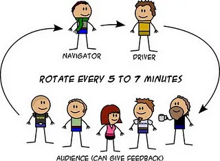

# Coding Dojo

### Princípios e regras
- Pair Programming: programação em par;
- Passos de Bebê: cada etapa para a solução deve ser pequena o suficiente para que todos possam compreender e replicar mais tarde;
- Refactoring: refatoração de código;
- Test Driven Development — TDD: antes de ser escrito uma implementação de código é escrito um teste;
- Teste quebrando pode dar feedback, passando silêncio;

# Jokenpo
# Você está resolvendo este problema!!

Jokenpo é uma brincadeira japonesa, onde dois jogadores escolhem um dentre três possíveis itens: Pedra, Papel ou Tesoura.

O objetivo é fazer um juiz de Jokenpo que dada a jogada dos dois jogadores informa o resultado da partida.

As regras são as seguintes:

- Pedra empata com Pedra e ganha de Tesoura
- Tesoura empata com Tesoura e ganha de Papel
- Papel empata com Papel e ganha de Pedra